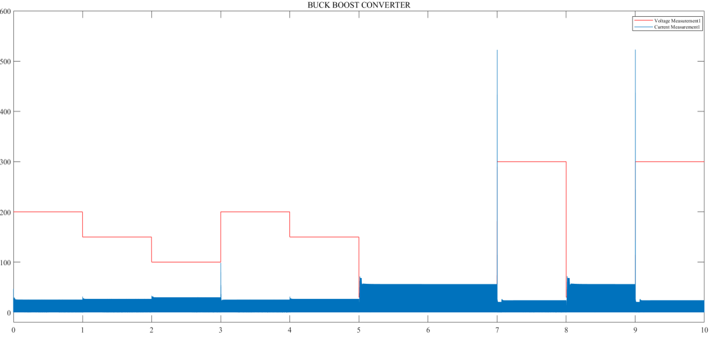
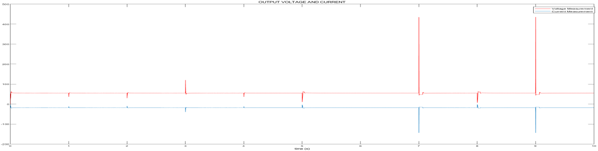
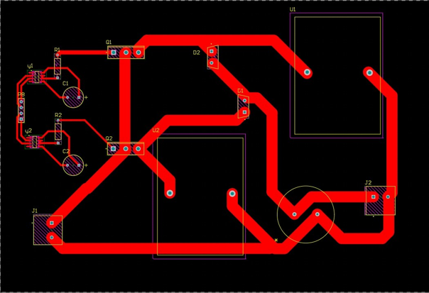

# FPGA-Based Parallel Buck–Boost Converter with FOPI Control for Renewable Energy Applications


---


---

## Abstract

Wind Energy Conversion Systems (WECS) produce wildly variable DC voltages (30 V – 400 V) depending on wind conditions. This project designs, simulates, and implements a **two-phase interleaved parallel buck-boost converter** regulated by a **Fractional Order Proportional-Integral (FOPI) controller** synthesized on an **Intel DE10-Standard FPGA (Cyclone V)**. The FOPI controller maintains a stable **55 V DC output at 1 kW** across the full input range, outperforming conventional PI control in overshoot, settling time, and steady-state accuracy.

---

## Repository Structure

```
├── HARDWARE OUTPUT/
│   ├── Block_Diagram.png          # System-level closed-loop block diagram
│   ├── HW1.png / HW2–4.jpg       # Lab test setup and hardware photographs
│   └── capstone.png               # Poster / demo snapshot
│
├── PCB/
│   ├── Sheet1.SchDoc              # Altium schematic
│   ├── CapController.PrjPcb       # Altium PCB project
│   ├── PCB.png                    # PCB layout screenshot
│   ├── pcb.zip                    # Fabrication-ready Gerber package
│   ├── PcbLib1/2.PcbLib           # PCB footprint libraries
│   ├── Schlib1/2.SchLib           # Schematic symbol libraries
│   └── CAMtastic*.Cam             # Individual Gerber layer files
│
├── RTL/
│   ├── top_de10_fopi_adc_pwm.v    # Top-level (DE10-Standard target)
│   ├── adc_interface.v            # SPI ADC driver (12-bit)
│   ├── voltage_sensing.v          # ADC code → millivolt conversion
│   ├── fopi_controller_55V.v      # FOPI control law (incremental form)
│   ├── pi_controller.v            # Integer PI (comparison baseline)
│   ├── pwm_deadtime_2mosfet.v     # 50 kHz PWM + complementary dead-time
│   ├── FPGA1.png / FPGA2.png      # Quartus compilation screenshots
│   └── fpga.jpg                   # FPGA board photo
│
└── SIMULINK/
    ├── fopibkbt.slx.zip           # MATLAB/Simulink plant + controller model
    ├── Simulink.png               # Model screenshot
    ├── Input_Voltage_Simulation.png
    └── Output_Voltage_Simulation.png
```

---

## System Architecture

```
  Vin (30–400 V)
       │
  ┌────▼─────────────────────────────────────────────────┐
  │               DE10-Standard FPGA (Cyclone V)         │
  │                                                       │
  │  adc_interface ──► voltage_sensing                   │
  │       (SPI)          (ADC→mV)                        │
  │                          │                           │
  │                   fopi_controller_55V                │
  │                    (10 kHz update)                   │
  │                          │                           │
  │                     duty_latch                       │
  │                          │                           │
  │               pwm_deadtime_2mosfet                   │
  │                (50 kHz, dead-time)                   │
  └──────────────┬────────────┬─────────────────────────┘
                 │            │
             pwm_high      pwm_low
             (QH MOSFET)  (QL MOSFET)
                 │            │
          ┌──────▼────────────▼──────┐
          │  Interleaved Buck-Boost   │
          │  L=0.4mH × 2, C=363µF   │──► Vout = 55 V / 1 kW
          └──────────────────────────┘
```

---

## Specifications

| Parameter | Value |
|---|---|
| Input Voltage | 30 V – 400 V |
| Output Voltage | 55 V DC |
| Output Power | 1 kW |
| Output Current | 18.18 A |
| Load Resistance | 3.025 Ω |
| Per-phase Inductance | 0.4 mH |
| Output Capacitance | 363 µF |
| Switching Frequency | 50 kHz |
| Control Update Rate | 10 kHz |
| FPGA Clock | 50 MHz on-board → 100 MHz (PLL) |
| ADC Resolution | 12-bit (SPI) |
| PWM Resolution | 10-bit (0–1000 counts) |
| Dead-time | 20 clock cycles (200 ns @ 100 MHz) |
| Duty Cycle Limits | 300 – 950 / 1000 |

---

## FOPI Controller

### Transfer Function

$$C(s) = K_p + \frac{K_i}{s^\lambda}$$

### Tuned Parameters (SIMC Iso-Damping Method)

| Parameter | Value |
|---|---|
| Kp | 0.000403 |
| Ki | 5.990702 |
| λ (fractional order) | 1.318576 |
| Gain crossover frequency ωc | 0.24 rad/s |

The fractional order λ was selected using the relative delay ratio τ = L/T = 5×10⁻⁶ / 2.48×10⁻⁵. For FOPTD systems where 0.1 < τ < 0.4, the optimal λ lies between 0.6–0.8; λ = 0.67 was chosen to balance transient performance with robustness.

### Discrete-Time Incremental FOPI (Verilog)

The controller runs **only on `control_tick`** (10 kHz one-cycle pulse). Between ticks it holds the previous duty cycle — this is the critical hold-state that eliminates PWM jitter:

```
acc[n] = acc[n-1] + (KP × (error[n] − error[n-1])) >> 7
                  + (KI × error[n]) >> 9
duty = clamp(acc, DUTY_MIN=300, DUTY_MAX=950)
```

---

## Stability Analysis

Phase margin stays nearly constant (60°–68°) across the full 30–400 V input range — iso-damping is achieved. Buck mode gains exceed 120 dB, confirming high robustness.

| Vin (V) | Mode | D | DC Gain (dB) | ωn (rad/s) | ζ | PM (°) | GM (dB) |
|---|---|---|---|---|---|---|---|
| 30 | Boost | 0.4545 | 45.3 | 2024 | 0.2249 | 60.0 | 18.0 |
| 40 | Boost | 0.2727 | 40.3 | 2699 | 0.1687 | 61.6 | 23.5 |
| 55 | Buck | 1.0000 | 34.8 | 3711 | 0.1227 | 62.1 | 142.2 |
| 100 | Buck | 0.5500 | 40.0 | 3711 | 0.1227 | 62.9 | 137.0 |
| 200 | Buck | 0.2750 | 46.0 | 3711 | 0.1227 | 64.6 | 131.0 |
| 400 | Buck | 0.1375 | 52.0 | 3711 | 0.1227 | 68.2 | 125.0 |

---

## RTL Modules

| Module | File | Description |
|---|---|---|
| `top_de10_fopi_adc_pwm` | `top_de10_fopi_adc_pwm.v` | Top-level; wires all sub-modules for DE10-Standard |
| `adc_interface` | `adc_interface.v` | SPI state machine; reads 12-bit ADC over MOSI/MISO/CS |
| `voltage_sensing` | `voltage_sensing.v` | `vout_mV = (adc_data × 3000 × 28) / 4095` |
| `fopi_controller_55V` | `fopi_controller_55V.v` | Incremental FOPI; updates only on `control_tick` |
| `pi_controller` | `pi_controller.v` | Integer PI baseline for comparison |
| `pwm_deadtime_2mosfet` | `pwm_deadtime_2mosfet.v` | 50 kHz counter; complementary QH/QL with dead-time guard |

---

## Simulation Results

| | |
|---|---|
|  |  |
| **Input:** step sweep 30 V → 400 V with transient current spikes | **Output:** stable ~55 V with fast recovery after each disturbance |

Simulink model: `SIMULINK/fopibkbt.slx.zip`

---

## Hardware Results

| | |
|---|---|
|  |  |
| FPGA + breadboard test bench | Oscilloscope PWM waveform |

- **Measured output voltage:** ~54.9 V DC (multimeter verified)
- **PWM waveform:** 50 kHz, ~82.5% duty cycle at nominal operating point
- **Switching transients:** Minor ringing at transitions from parasitic elements — within expected bounds

---

## PCB Design



Designed in **Altium Designer**. Gerber files ready for fabrication in `PCB/pcb.zip`.

Red traces carry high-current paths; component placement minimises loop area for EMI and thermal management.

---

## FPGA Setup (DE10-Standard)

**Device:** Intel Cyclone V 5CSXFC6D6F31C6  
**Tool:** Intel Quartus Prime  
**Clock:** 50 MHz on-board oscillator (PLL ×2 → 100 MHz system clock)

| Signal | DE10-Standard Pin |
|---|---|
| `clk` | PIN_AF14 (50 MHz OSC) |
| `rst` | KEY[0] |
| `adc_sclk / mosi / miso / cs` | GPIO header (SPI) |
| `pwm_high` | GPIO_0[0] |
| `pwm_low` | GPIO_0[1] |

Update `fopi_converter.qsf` with your exact GPIO wiring before compiling.

**Compile and program:**
```bash
quartus_sh --flow compile fopi_converter.qpf
quartus_pgm -m jtag -o "p;output_files/fopi_converter.sof"
```

---

## Testbench Coverage

The testbench (`top_de10_fopi_adc_pwm_tb.v`) exercises:

- Reset behaviour and startup from 0 V
- SPI ADC data transfer correctness
- Voltage scaling accuracy (`adc_data → mV`)
- PWM frequency (50 kHz) and duty cycle accuracy
- Startup transient (0 V → 55 V)
- Sudden load step disturbance
- Input voltage sweep (30 V ↔ 400 V)
- Controller response sign check
- Duty cycle clamping at `DUTY_MIN` / `DUTY_MAX`

**Run with ModelSim / Questa:**
```bash
vlib work
vlog RTL/*.v
vsim -novopt work.top_de10_fopi_adc_pwm_tb
add wave /*
run -all
```

---

## Bill of Materials

| Component | Qty | Cost (INR) |
|---|---|---|
| Capacitor (363 µF) | 1 | 120 |
| Inductor (0.4 mH) | 2 | 3,000 |
| Resistor (3.025 Ω) | 1 | 15 |
| Diode | 2 | 350 |
| PCB (fabricated) | 1 | 5,000 |
| MOSFET Driver | 2 | 260 |
| Gate Driver | 2 | 160 |
| Heatsinks | 4 | 100 |
| **Total** | | **₹9,005** |

---

## References

1. Yousaf Haroon, Amjadullah Khattak — "Design and Analysis of FOCS for Buck Converter PV Emulator," *GSJ*, Vol. 8, Feb 2020.
2. Mahmoud F. Mahmoud et al. — "Different Approximation Techniques for a FOPID," *ICM 2022*.
3. Maximiliano Bueno-Lopez, Eduardo Giraldo — "Real-Time Fractional Order PI for Embedded Control of a Synchronous Buck Converter," *Engineering Letters*, Vol. 29:3, Sep 2021.
4. S. Vijayalakshmi et al. — "Modeling and Simulation of Interleaved Buck Boost Converter with PID Controller," *IEEE ISCO 2015*.
5. Manjusha Silas, Surekha Bhusnur — "Optimal Fractional Order Controller Design for a DC Buck Converter," *EVERGREEN*, Vol. 11(2), Jun 2024.
6. Cihan Ersali, Goran Hekimoglu — "FOPID Controller Design for a Buck Converter Using Hybrid Cooperation Search Algorithm," *GU J Sci Part A*, 10(4), 2023.
7. G. Prithivi, P. Madasamy — "Parallel Connected Buck-Boost Converter for PV Application Using PI Controller," *IJAREEIE*, Vol. 7(2), Feb 2018.
8. N H Baharudin et al. — "Performance Analysis of DC-DC Buck Converter for Renewable Energy Application," *IOP Conf. Series*, 2018.
9. H. Shayeghi et al. — "A Buck-Boost Converter; Design, Analysis and Implementation for Renewable Energy Systems," *Iranian J. EEE*, 2021.
10. Seyyed Morteza Ghamari et al. — "Improved Robust Fractional-Order PID Controller for Buck-Boost Converter using Snake Optimization Algorithm," *IET Control Theory & Applications*, Feb 2025.

---

## Acknowledgements

- **Dr. Nithya Venkatesan** — Project Supervisor, VIT Chennai
- **Dr. Eldad Avital** — External Collaborator, Queen Mary University of London, UK
- **SPARC-UKIERI Grant P-3789** — Funding support
- Dr. Saravana Kumar · Mr. Devaraj (lab support) · Mr. Sabavath Jayaram & Mr. Sohorab Hussain (PhD scholars)
- Dr. Lenin NC (Dean, SEE) · Dr. Angeline Ezhilarasi (HoD, EEE) · VIT Chennai

---

*B.Tech EEE Capstone — VIT Chennai, April 2026. Reuse with attribution.*
